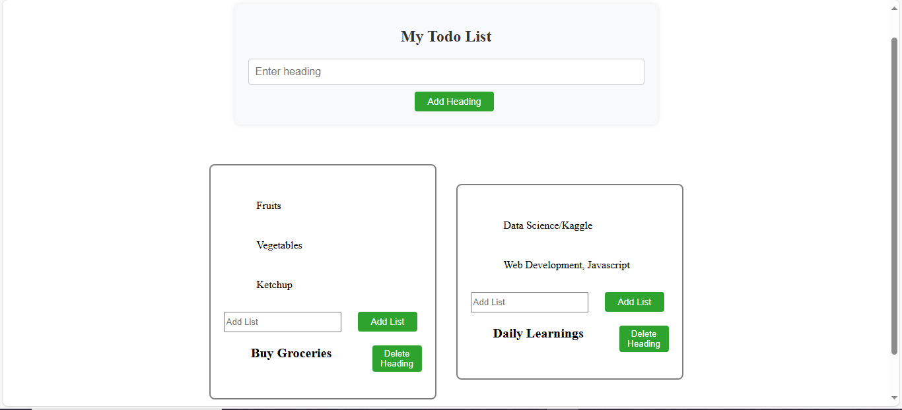

# 📝 ToDoList – A Dynamic Task Management App Built with React

## 🌟 Overview

**ToDoList** is a responsive and interactive task management application built using **React (JavaScript)**, **HTML**, and **CSS**. This project focuses on simplifying daily task organization with a nested to-do structure, allowing users to manage headings (categories) and associated sub-tasks (lists) under each heading. It showcases the power of component-based design and React's state management in building modern user interfaces.

---

## 🧠 Big Picture

This app represents a scalable approach to building structured productivity tools using front-end technologies. It follows these key design principles:

- **Component-Based Architecture**: Reusable UI components built with React.
- **State Management with Hooks**: Real-time UI updates using `useState`.
- **Separation of Concerns**: Cleanly separated logic (JavaScript), structure (HTML/JSX), and styling (CSS).
- **Scalable List Nesting**: Add multiple headings, and under each heading, manage multiple lists dynamically.

The application can serve as a building block for larger productivity tools like:
- Project Planners
- Bullet Journals
- Study Schedulers
- Team Task Boards

---

## ⚙️ Features

- 📌 **Add Multiple Headings**: Create categories like "Work", "Groceries", "Goals", etc.
- 📋 **Add Lists Under Each Heading**: Add task items under specific headings.
- ❌ **Delete Headings**: Remove entire task categories with a single click.
- 💡 **Dynamic Input Handling**: Each heading maintains its own input field for adding lists.

---

## 🛠 Tech Stack

- **Frontend**: React (JSX)
- **Styling**: CSS
- **JS Features**: `useState`, dynamic rendering, array manipulation

---

